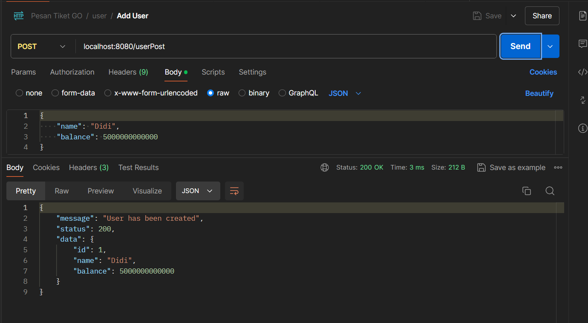
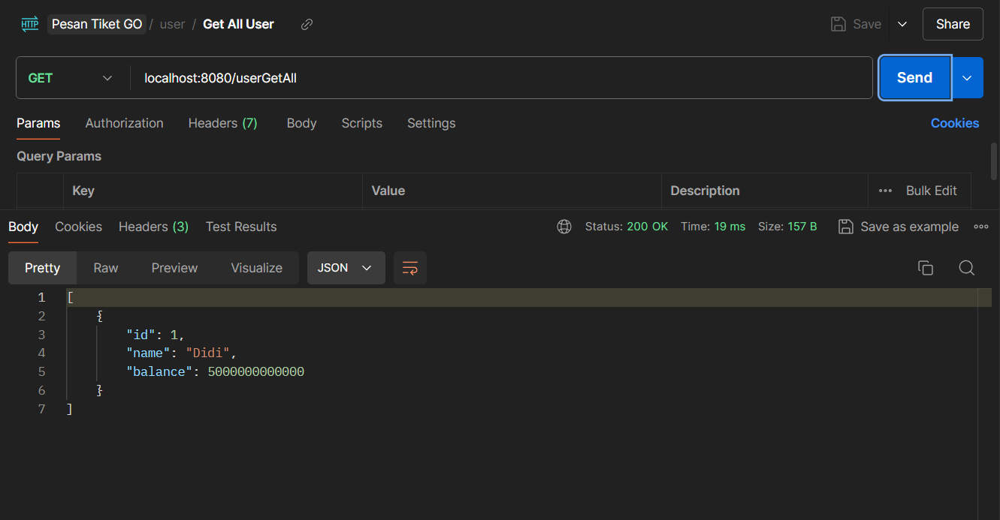
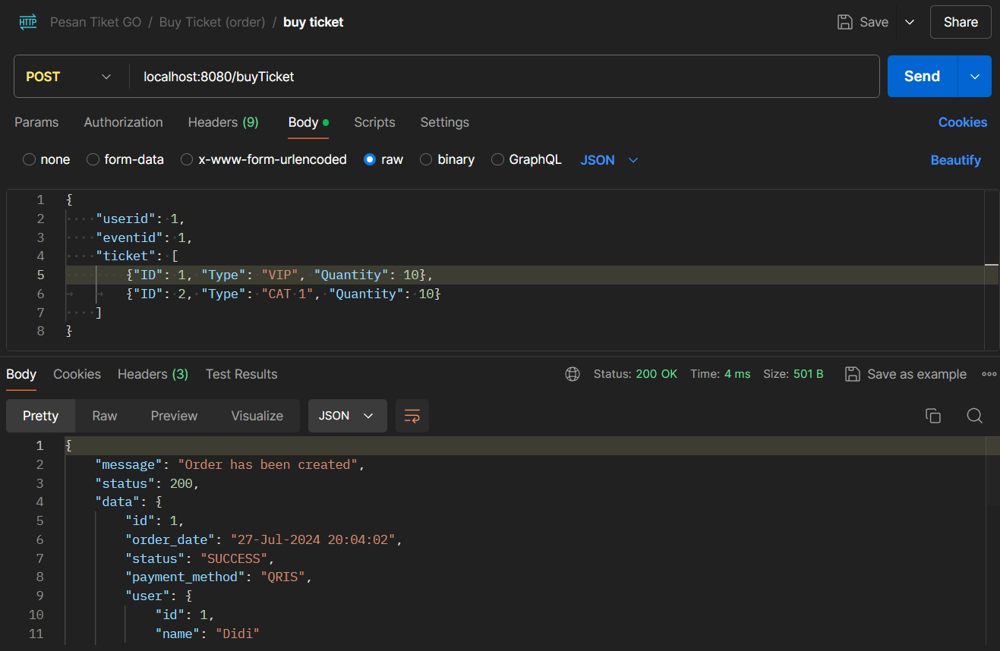
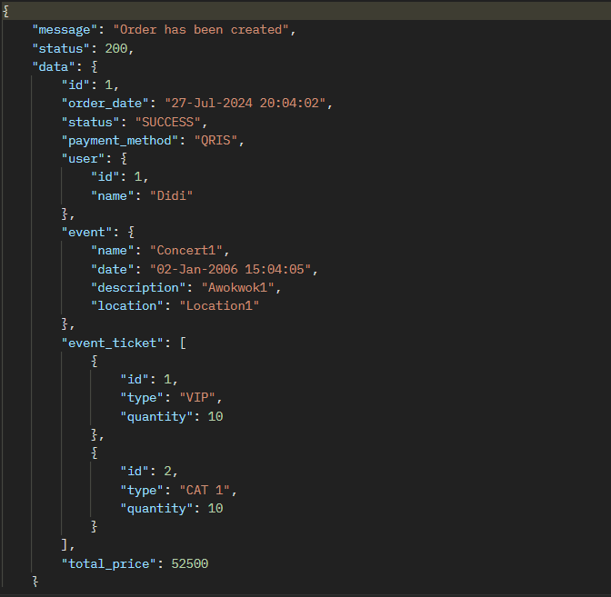
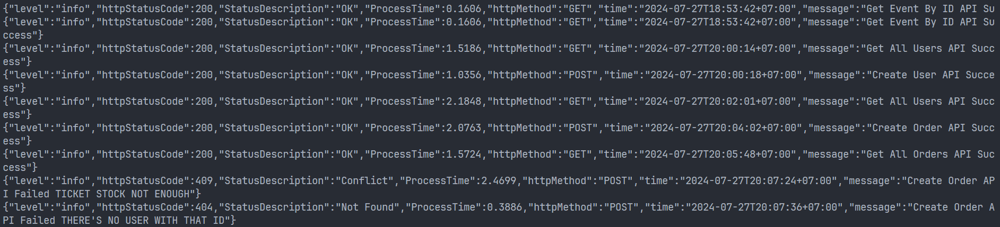

# PesenTiketOnlineGolang

This is a golang app about online ticket buy with goroutine and http. It runs on port 8080 and have 15 end points that can be used.

## First this is the endpoint to get all event and tickets

## Next is the andpoint to add user and view users

## Last is the endpoint for buy and creating order transaction details

##The respond json should be like this

## The log view should be like this everytime you hit an endpoint it will show wether it success or not

### There are other end point that can be used to perform CRUD to User and Events. You can see it on file main.go
