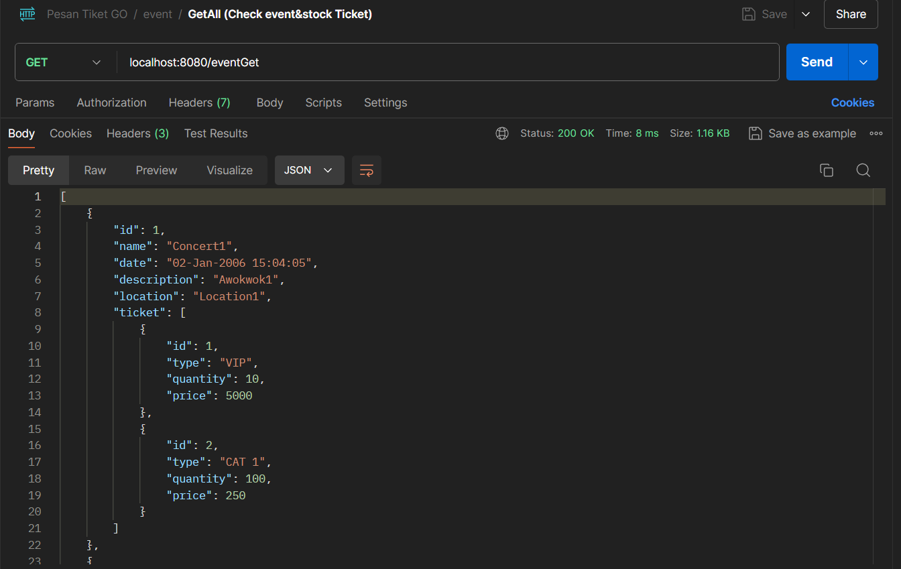
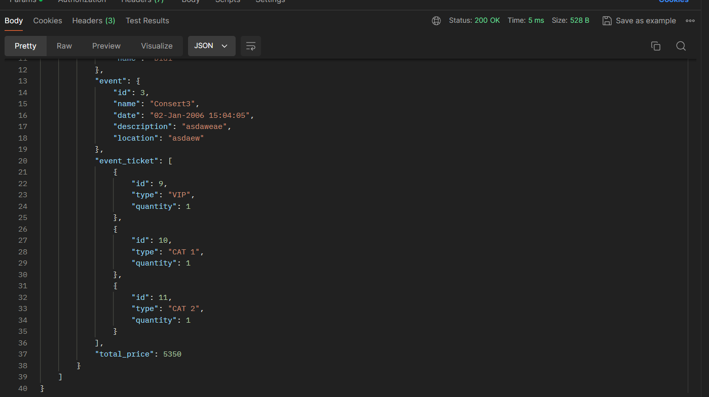

# PesenTiketOnlineGolang

This is a golang app about online ticket buy with goroutine and http. It runs on port 8080 and have 15 end points that can be used.

## First this is the endpoint to get all event and tickets

## Next is the andpoint to add user and view users

## Last is the endpoint for buy and creating order transaction details

## The respond json should be like this.

### If the order status success then the ticket stock and also the balance of the user is reduced

## The log view should be like this everytime you hit an endpoint it will show whether it success or not

## Next is the update where I added database for storing events, users, and orders (transaction details)
## Event Endpoints
### First is the endpoint to create an Event. It will looks like this

### Next is the endpoint to View Events (All events and by id)

### Next is the endpoint to Add a new ticket to the event

### Last is the endpoint to delete an event in database

## User Endpoints
### First is the endpoint to create User. It will looks like this

### Next is the endpoint to View Users (All users and by id)

### Next is the endpoint to update user's balance

### Last is the endpoint to delete user DB

## Order (Transaction Detail) Endpoints
### First is the endpoint to create an Order. It will looks like this

### Next is the endpoint to View Order (All orders and by User ID)
#### This is Get All Orders

#### This is Get Orders by User ID

## This is What The log looks like
### There are 2 log, the success one and the failed(error) one. The only difference is that the failed log (log error) is telling us the error messages, while the success one is not

### There are other end point that can be used to perform CRUD to User and Events. You can see it on file main.go
